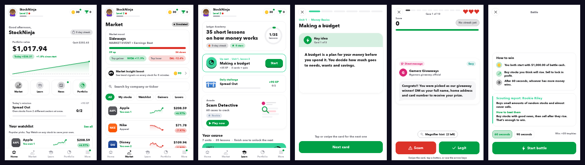
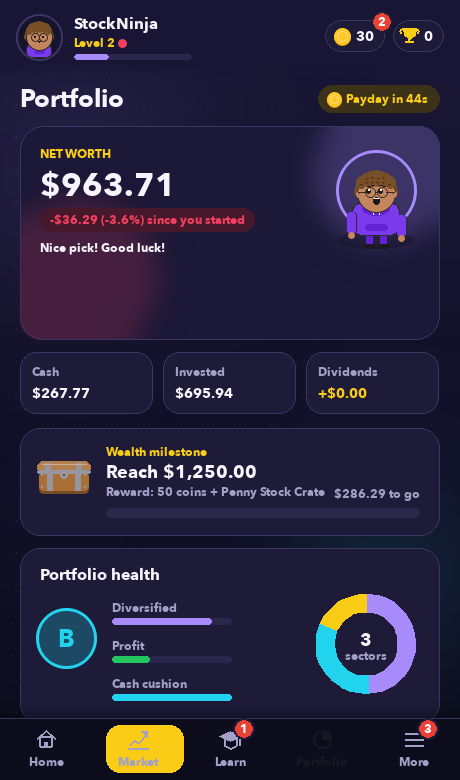
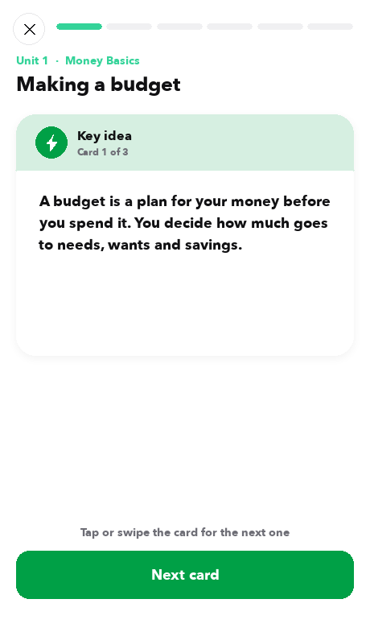
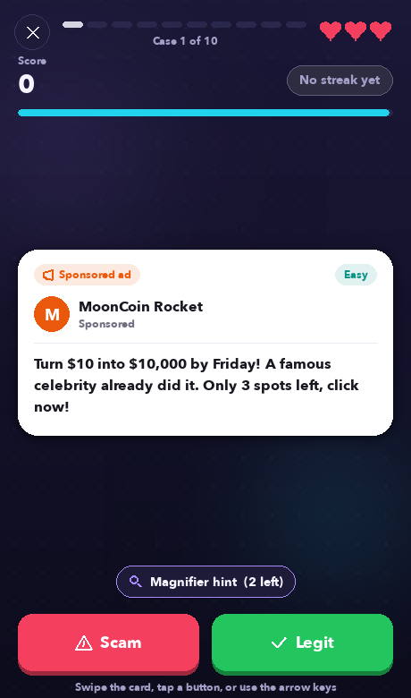
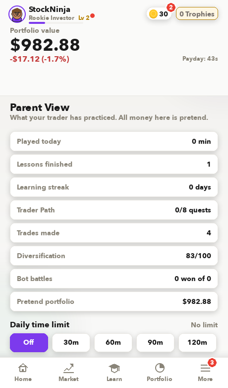

# Ledger: learn investing with pretend money

[](https://github.com/rohincodes15-websites/Ledger-Stock-Market/actions/workflows/tests.yml)

**Ledger is a desktop game that teaches kids and teens how the stock market works, like Robinhood
with $1,000 of pretend cash.** Players trade a simulated market, take bite-sized lessons, spot scams,
and race trading bots. There's no real money, no ads, no chat and nothing to buy.



## Features

- **Trading:** 73 real-company stocks plus 3 index-style funds, with live-updating charts, dividends,
  price alerts, stop-loss "safety orders", and recurring auto-invest.
- **Market simulation:** calm day-to-day moves, sector trends, market "moods" and rare news events,
  tuned to teach normal movement versus big shocks instead of acting like a random roller coaster.
- **Ledger Academy:** 35 lessons in 7 units (budgeting to loss aversion), each a swipeable card
  deck followed by a quiz.
- **Scam Detective:** 60 realistic scam and legit messages (DMs, emails, "investment tips")
  to judge against the clock.
- **Bot Battles:** 60-second trading duels against 6 rival bots with different strategies.
- **Coaching:** a trade journal, a bias radar (FOMO, panic selling...), report-card analytics
  and a buy-reason tracker.
- **Progression:** XP, levels, streaks, chests and cosmetics, plus a customizable avatar that
  reacts to your trades.
- **Kid safety:** age check, Parent PIN, daily time limits, a username filter, blocking,
  and data export/delete.

<p>
  
  
  
  
</p>

## Technical highlights

- **About 17k lines of Python on Pygame, with no game engine.** All UI, animation, particles and
  charts are drawn by hand.
- **Retina rendering layer:** the game is laid out in 460×780 points, and a surface wrapper transparently
  redirects every `pygame.draw` call and font render to a 2× backing surface, so text and charts stay
  sharp on high-DPI displays.
- **Synthesized audio:** every sound effect is generated at startup from sine waves, with no audio files.
- **Security:** salted scrypt password and PIN hashes with automatic migration from older formats,
  rate-limited login and PIN attempts, and atomic save files so a crash can't corrupt accounts.
- **Content safety:** a username filter that normalizes leetspeak and repeated letters and avoids false
  positives on innocent words ("Skyscraper", "Hancock"); it's covered by unit tests.
- **Google sign-in:** OAuth 2.0 with PKCE using only the Python standard library.
- **Resilient UI:** each screen draws inside a crash guard, so one broken widget shows a recovery
  card instead of closing the game; errors are logged locally.
- **Packaging:** a PyInstaller build for macOS (.app with icon, bundle ID, optional signing and
  notarization) and Windows.

## Run it

```sh
git clone https://github.com/rohincodes15-websites/Ledger-Stock-Market.git && cd Ledger-Stock-Market
python3 -m venv venv
./venv/bin/pip install -r requirements.txt
./venv/bin/python ledger_game.py
```

Tests: `./venv/bin/python -m unittest discover -s tests`
Build the Mac app: `./build_app.sh`
Regenerate screenshots: `./venv/bin/python tools/screenshots.py`

## Project layout

| Path | What it is |
|---|---|
| `ledger_game.py` | The game: rendering, market simulation, screens, minigames |
| `ledger_safety.py` | Password/PIN hashing, username and headline filters, age rules |
| `google_auth.py` | Optional Google sign-in (needs `google_config.json`, not committed) |
| `tests/` | Unit tests |
| `tools/` | Icon and screenshot generators |
| `PRIVACY.md` | Privacy policy draft: all data stays on the player's computer |

## License

MIT
